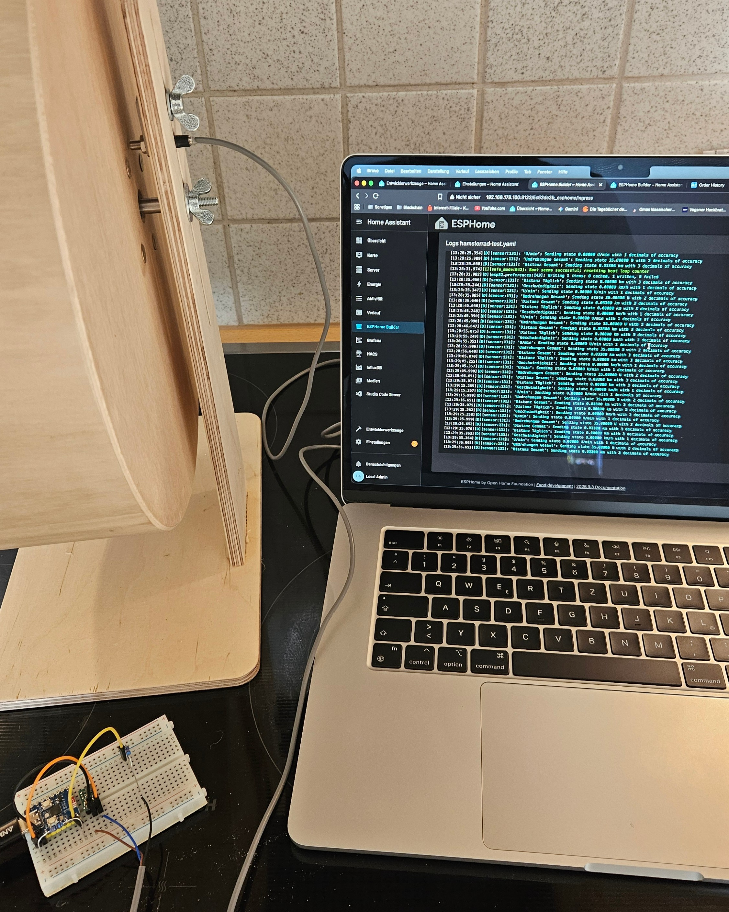
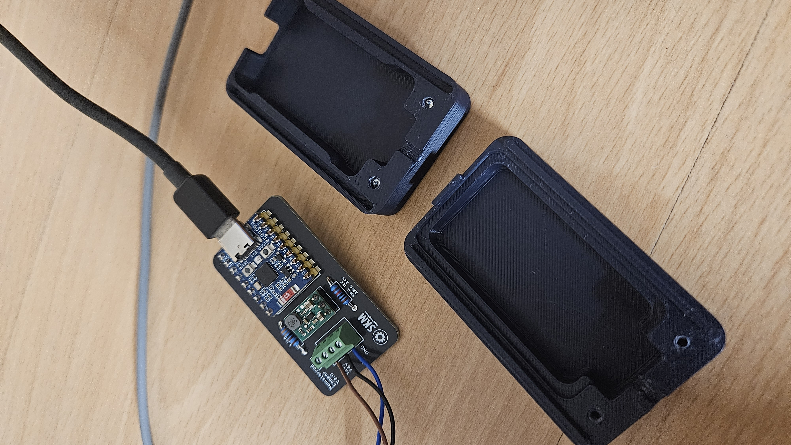

# Smartes Hamsterrad mit Home Assistant Reisetagebuch

Willkommen beim Projekt "Smartes Hamsterrad"! Dieses Repository enthält alle notwendigen Dateien, Codes und Anleitungen, um ein Standard-Hamsterrad (z.B. von Getzoo) in einen vollwertigen Fitness-Tracker zu verwandeln.

Das System erfasst die Aktivität des Hamsters über einen induktiven Sensor, verarbeitet die Daten auf einem **ESP32-C6** und sendet sie an **Home Assistant**. Dort wird ein detailliertes Dashboard inklusive eines "Reisetagebuchs" generiert.


---

## Projekt-Entstehung & Geschichte

Wenn du mehr über die Entstehungsgeschichte, die Motivation und die Herausforderungen (z.B. die "Verhandlungen" mit der Verlobten) erfahren möchtest, lies den originalen Magazin-Artikel, den wir für dieses Projekt geschrieben haben.

<details>
<summary><b>Klick hier, um den Magazin-Artikel zu lesen...</b></summary>

## Kilometer-Zähler für kleine Pfoten: Mein Hamsterrad wird smart und erzählt Geschichten


Wessen Traum ist es nicht, morgens aufzuwachen und genau zu wissen, wie viele Kilometer der eigene Hamster in der Nacht gelaufen ist? Wie schnell war er? Und wie weit ist er insgesamt schon gekommen?
Schon als Kind war ich absolut fasziniert, wenn ich in Büchern und Berichten las, welche unglaublichen Strecken diese winzigen Tiere in einer einzigen Nacht zurücklegen können. Ich fragte mich schon damals: „Kann das wirklich sein? Das will ich selbst erforschen.“ Leider hatte ich als Kind und Jugendlicher Pech: Keiner meiner damaligen Hamster mochte sein Laufrad. Sie ignorierten es konsequent. Und so blieb dieser kleine Traum unerfüllt.
Viele Jahre später, jetzt als Erwachsener, habe ich durch meine Verlobte wieder einen Hamster. Und dieser ist das genaue Gegenteil. Er liebt sein Rad und verbringt jede Nacht mit großer Freude darin. Man kann sich vorstellen, was passierte: Der alte Kindheitstraum war sofort wieder da! Dieses Mal hatte ich bereits durch andere Projekte auch die nötigen Fertigkeiten, um ihn wahr werden zu lassen.

### „Bauen ja – stören nein!“

Die Überzeugungsarbeit bei meiner Verlobten dauerte zum Glück nicht lange, aber sie steckte mir sofort ganz klare Grenzen für das Projekt: Der Hamster durfte auf keinen Fall gestört und niemals durch Kabel oder Sensoren gefährdet werden. Zudem musste das wertvolle Getzoo-Korklaufrad absolut intakt bleiben.
Das war eine echte Herausforderung, denn meine ersten Ideen waren damit sofort vom Tisch. Sensoren, die einen Schall aussenden, könnte er hören und sich gestört fühlen. Sensoren, die Licht aussenden, wie eine Lichtschranke, könnten ihn nachts stören, besonders da das Licht im gesamten Nagarium reflektiert werden würde. Mechanische Sensoren wiederum würden das Rad zu sehr abbremsen und den Laufwiderstand erhöhen.
Die Wahl fiel daher auf einen sogenannten "induktiven Sensor". Dieser reagiert einfach, wenn ein Stück Metall an seiner Sensorfläche vorbeigeführt wird – komplett kontaktlos, ohne Geräusche und ohne störendes Licht. Die perfekte hamstersichere Lösung.
Als "Gehirn" des Ganzen kam für mich nur ein winziger Mini-Computer infrage (für Technik-Fans: ein Espressif ESP32-C6), da ich mit diesem Chip bereits mehrere andere Smart-Home-Projekte umgesetzt habe.

### „Vom Küchentisch zum 3D-Druck"

Die erste Hürde war technischer Natur: Der Sensor arbeitet mit einer anderen Stromspannung (12 Volt) als der Mini-Computer (5 Volt). Ich konnte sie also nicht einfach verbinden, ohne den Chip zu zerstören. Ich musste mir eine kleine Schaltung überlegen, um die Spannung auf ein sicheres Niveau für den Mini-Computer zu bringen.
Der allererste Versuchsaufbau fand auf einem kleinen Test-Board statt: Mit ein paar Kabeln, dem Laptop zum Programmieren und dem Laufrad. Hier war dann auch bereits der Sensor final am Laufrad befestigt. Als Metall, das den Sensor betätigen soll, habe ich vier Reißbrettstifte ins Rad eingedrückt und geklebt. Eine Veränderung am Rad, die meine Verlobte akzeptiert hat und die den Hamster nicht stört oder gefährdet.
Dieser provisorische Aufbau mit dem Test-Board wirkte mir aber auf Dauer viel zu unprofessionell und alles andere als eine dauerhafte Lösung. Ich habe daher eine richtige, professionellere Platine entworfen, auf der alle Komponenten ihren festen Platz haben. Diese war auch nicht teuer und hat nur ein paar Euro gekostet. Damit war das Kabel-Chaos beseitigt. Als die Platine da war und bestückt, konnte es ans Entwerfen eines Gehäuses gehen. Dieses habe ich am Laptop in 3D konstruiert und mit Hilfe meines 3D-Druckers gefertigt.

### Die Daten-Fabrik: Was passiert hinter den Kulissen?

Nachdem die Hardware fertig und sicher verbaut war, ging es ans Programmieren. Das System hat eine klare Zweiteilung. Zuerst ist da der Mini-Computer am Laufrad, das eigentliche "Arbeitspferd". Er sitzt direkt am Rad, fängt jeden Impuls vom Sensor ab und zählt fleißig mit. Aus der Anzahl der Impulse (vier pro Umdrehung dank der Reißbrettstifte) und der Radgröße (31,4 cm) errechnet er die Gesamtdistanz, die tägliche Distanz (diese wird jeden Abend um 20 Uhr automatisch zurückgesetzt) und die aktuelle Geschwindigkeit.
Diese Rohdaten sendet der Mini-Computer dann per WLAN an den zweiten Teil des Systems: meine Smart-Home-Zentrale (eine Software namens "Home Assistant"). Hier, in der digitalen Kommandozentrale, passieren die spannenden Dinge. Die Zentrale empfängt und speichert die Werte und stellt dann weitere Berechnungen an, wie zum Beispiel die Höchstgeschwindigkeit der letzten Nacht und die allgemeine Durchschnittsgeschwindigkeit (nur wenn der Hamster aktiv ist). Außerdem vergleicht sie diese Werte mit den bisherigen Bestleistungen und berechnet so, ob der Hamster einen neuen Geschwindigkeits- oder Tagesstrecken-Rekord aufgestellt hat.

### Der Lohn der Mühe: Tägliche Berichte und eine Weltreise

Der wahre Zauber dieses Projekts zeigt sich jeden Morgen und macht das Aufstehen so viel schöner. Da mein Handy ebenfalls mit meinem Smart-Home verbunden ist, bekomme ich pünktlich beim Aufstehen eine Push-Nachricht. Sie verrät mir, wie viele Kilometer der Hamster in der Nacht gelaufen ist und ob er es geschafft hat einen neuen Strecken- oder Geschwindigkeitsrekord aufzustellen.
Für all diese Daten habe ich ein übersichtliches Dashboard auf dem Tablet eingerichtet. Dort sehe ich die komplette Analyse der letzten Nacht und kann auch in den vergangenen Werten stöbern.
Als Krönung der ganzen Datensammlerei habe ich ein "Hamster-Reisetagebuch" ins Leben gerufen. Denn was ist eine Zahl wie 251,39 km schon wert, wenn man sie nicht in ein Abenteuer verwandelt? Diese Strecke ist er übrigens in weniger als einem Monat gelaufen (Start der Reise: 5. Oktober 2025)! Das Dashboard zeigt jetzt eine virtuelle Reise, auf der wir (Luftlinie) verfolgen, wie weit er von zu Hause entfernt ist.
Die Liste der Ziele habe ich mir übrigens nicht mühsam von Hand rausgesucht. Statt einer einzelnen Route habe ich eine KI gebeten, mir ganz viele interessante Orte zu nennen, die in verschiedener Luftlinien-Entfernung von unserem Zuhause liegen – bis hin zum ultimativen Ziel: Vancouver, 9.650 km entfernt!
Und so ist unser Hamster jetzt ein Weltenbummler. Jeden Morgen schauen wir, wo er steckt: Trier (35 km) und Luxemburg (85 km) hat er locker passiert, Paris (195 km) war ein kurzer Stopp, und Stuttgart (215 km) liegt auch schon hinter ihm.
Ob er es eines Tages wirklich bis nach Kanada schafft? Ich bin gespannt! Aber eines hat mir das Projekt jetzt schon gezeigt: Diese kleinen Tiere sind unglaubliche Athleten, und mein Kindheitstraum war jeden einzelnen Lötkolben-Einsatz wert.

</details>

---


## Features

* **Live-Geschwindigkeit** in km/h.
* **Tagesdistanz** (wird täglich um 20:00 Uhr zurückgesetzt).
* **Gesamtdistanz** (persistent gespeichert auf dem ESP).
* **Rekord-Tracking** für die höchste Geschwindigkeit und die längste Tagesstrecke (über `input_number` Helfer in HA).
* **"Hamster-Reisetagebuch"** als Lovelace Markdown-Karte, die die Gesamtdistanz in eine virtuelle Reise umrechnet.
* **Push-Benachrichtigungen** am Morgen mit den "Stats der Nacht" (via Home Assistant Automation).

---

## Technische Funktionsweise & Schaltung

Das Herzstück des Projekts ist eine custom Platine, die die Stromversorgung und Signalverarbeitung übernimmt.

1.  **Stromversorgung:** Das System wird über den USB-C-Anschluss des **Waveshare ESP32-C6-Zero** mit 5V versorgt.
2.  **Sensor-Spannung (Step-Up):** Der induktive Sensor (H1) benötigt eine höhere Spannung (12V oder 24V). Diese wird durch einen **Pololu Step-Up Volt Regulator (U2)** erzeugt, der seine Eingangsspannung (5V) direkt vom ESP32-C6 (Pin 1) erhält.
3.  **Signalverarbeitung (Voltage Divider):** Der Sensor (H1) gibt ein 12V/24V-Signal aus. Dies wäre zu hoch für den ESP. Daher wird das Signal über einen **Spannungsteiler (R1/R2)** auf ein für den ESP (GPIO5, Pin 8) sicheres 3.3V-Level reduziert.
4.  **Widerstands-Wahl (R2):**
    * Verwende **R2 = 10kΩ** bei einem **12V**-Sensor.
    * Verwende **R2 = 22kΩ** bei einem **24V**-Sensor.
    * R1 ist immer **3.3kΩ**.
5.  **Impuls-Erfassung:** 4 Reißzwecken wurden in das Laufrad eingedrückt und verklebt. Der induktive Sensor erfasst diese Metallstifte und erzeugt **4 Impulse pro Umdrehung**.


---

## Benötigte Hardware (BOM)

* **MCU:** Waveshare ESP32-C6-Zero oder ähnlich
* **Sensor:** 3-Draht Induktiver Näherungssensor (z.B. LJ5A3-1-Z/AY, PNP, NO, M5 Gewinde)
* **Spannungsregler:** Pololu Step-Up Volt Regulator (z.B. bei 12V der U3V16F12)
* **Widerstände:**
    * 1x 3.3kΩ (R1)
    * 1x 10kΩ (R2 für 12V) ODER 22kΩ (R2 für 24V)
* **Sonstiges:**
    * Schraubterminal (3-Pin) für Sensoranschluss (H1)
    * Stiftleisten für ESP und Regler
    * 4x Reißzwecken
* **Platine:** Custom PCB (Gerber/Design-Dateien in `/Platine-PCB/`)
* **Gehäuse:** Custom 3D-Druck (STL-Dateien in `/Gehäuse-3D-Druck/`)

| Testaufbau in der Küche | Bestückte Platine (V2.0) | Platine im 3D-Gehäuse |
| :---: | :---: | :---: |
|  |  |  |


---

## Software-Installation

### 1. ESPHome

Der Code für den ESP32-C6 befindet sich in `Software/ESPHome-Code`.

1.  **Secrets:** Diese Konfiguration verwendet Secrets! Stelle sicher, dass du deine `secrets.yaml` (im ESPHome Hauptverzeichnis) mit den WLAN-Daten, einem API-Key und einem OTA-Passwort füllst, die in der `hamsterrad-esphome.yaml` referenziert werden.
    ```yaml
    # Beispiel für deine secrets.yaml
    wifi_ssid: "DEIN_WLAN_NAME"
    wifi_password: "DEIN_WLAN_PASSWORT"
    hamsterrad_api_key: "ERSTELLE_EINEN_SICHEREN_API_KEY"
    hamsterrad_ota_password: "ERSTELLE_EIN_OTA_PASSWORT"
    ```
2.  **Anpassungen:** Überprüfe die `substitutions` oben in der YAML-Datei. Passe ggf. den `rad_durchmesser_cm` (bei dir 31.4) und die `impulse_pro_umdrehung` (bei dir 4.0) an.
3.  **Flashen:** Kompiliere und flashe den Code auf deinen ESP32-C6.

### 2. Home Assistant

Der Code für die Lovelace-Karte befindet sich in `Software/Home-Assistant-Dashboard-Code`.

1.  **Helfer-Entitäten:** Die Karte ist auf diverse Helfer und Sensoren angewiesen, die du in Home Assistant anlegen musst (z.B. unter "Helfer" in den Einstellungen):
    * `sensor.hamsterrad_geschwindigkeit_max_12h` (z.B. über einen `max` Hilfssensor)
    * `sensor.hamsterrad_geschwindigkeit_durchschnitt_wenn_aktiv` (z.B. über einen `average` Hilfssensor)
    * `input_number.hamsterrad_distanz_taglich_rekord`
    * `input_number.hamsterrad_geschwindigkeit_rekord`
    * *...sowie die Sensoren, die von ESPHome bereitgestellt werden (`sensor.hamsterrad_distanz_taglich`, `sensor.hamsterrad_geschwindigkeit` usw.)*
2.  **Lovelace-Karte:** Erstelle eine neue "Manuelle Karte" in deinem Dashboard und kopiere den Inhalt der `Home-Assistant-Dashboard-Code` hinein.
3.  **Anpassung:** Passe die Kilometer-Marken und Orte im "locations"-Dictionary in der Markdown-Karte an deinen Wohnort an.

---

## Lizenz

Dieses Projekt steht unter der **MIT-Lizenz**. Du darfst die Designs und Codes gerne verwenden, anpassen und teilen. Siehe die `LICENSE`-Datei für Details.
